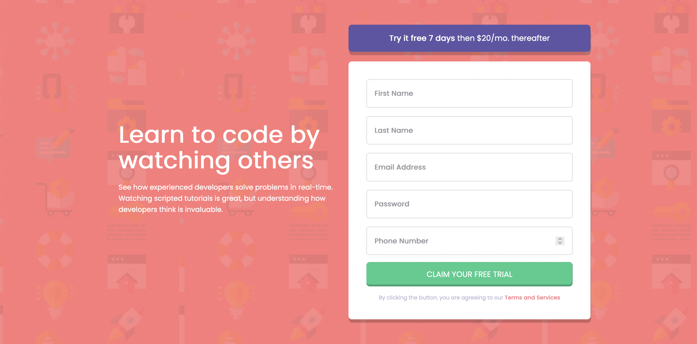

# Frontend Mentor - Intro component with sign-up form solution

This is a solution to the [Intro component with sign-up form challenge](https://www.frontendmentor.io/challenges/intro-component-with-signup-form-5cf91bd49edda32581d28fd1) on Frontend Mentor

## Table of contents

-  [Overview](#overview)
   -  [The challenge](#the-challenge)
   -  [Screenshot](#screenshot)
   -  [Links](#links)
-  [My process](#my-process)
   -  [Built with](#built-with)
   -  [What I learned](#what-i-learned)
   -  [Continued development](#continued-development)
   -  [Useful resources](#useful-resources)
-  [Author](#author)

## Overview

### The challenge

Your users should be able to:

-  View the optimal layout for the site depending on their device's screen size
-  See hover states for all interactive elements on the page
-  Receive an error message when the form is submitted if:
   -  Any input field is empty
   -  The email address is not formatted correctly

### Screenshot



### Links

-  Live Site URL:

## My process

### Built with

-  Semantic HTML5 markup
-  Mobile-first workflow
-  Flexbox
-  Vanilla JS

### What I learned

```html
<div class="errorMsg hidden"></div>
```

Considering this was my first time building and appending error messages in JavaScript into the DOM, I decided to hardcode a placeholder `<div>` to print each message for its corresponding input. Although a `<div>` has no semantic meaning to interrupt assistive technologies, it would have been better to build the whole error component in JavaScript and dynamically append it to whatever form input registered invalid data. I also won't be using Camel case class names as that naming convention should be strictly kept within Javascript.

```css
.btn-bg-purp {
   box-shadow: 1px 7px 0px 0px rgba(0, 0, 0, 0.2);
}

.input:not(:first-child) {
   margin-top: 0.9em;
}
```

I was proud of my ability to adjust the opacity of the buttons on hover and successfully re-create the box-shadow style according to the original design, without having to firstly conduct any research.

This project also provided a great means for using more advanced pseudo-classes which were used to create spacing between the inputs, except the first-child to avoid loosing the top-alignment. I have recently learnt that there is a common utility class titled the 'Lobotomised Owl' that achieves this same spacing effect, but it uses a universal selector to be more dynamic in targeting the desired children's markup. This will definitely be a class that I reuse in future projects, as the concept of alignment is one of the most fundamental features of good design.

```css
.wrapper {
   width: 80%;
   max-width: 460px;
}
```

Following on from my previous project, I was able to set a more appropiate max-width which didn't change into a desktop design until a later viewport width of 974px. Although there was clearly a lot of margin either side of the centered and vertically aligned card, it was necessary for the design to change at that width or it would have looked too narrow at the previous horizontal layout.

```js
let errorsArr = []
if (inputs[i].value === '' || inputs[i].value === null) {
   inputs[
      i
   ].nextElementSibling.textContent = `${inputs[i].placeholder} cannot be empty`
   errorsArr.push(inputs[i])
}
```

By far the most important concept I learned through this project was client-side validation. I learned that there are multiple methods to validating form data in JavaScript, such as using traditional conditional statements or the JavaScript Validity API, which provides built in methods and properties to achieve the same logic in perhaps a more readable manner.

All of this validation can be nicely setup to execute on a submit event which only occurs on the parent `<form>` when a submit button is clicked on. Once that event was fired, I ran a loop over all the inputs to first check whether they weren't empty, in order to continue running more specific validation checks for certain inputs.

```js
const numberFormatted = phoneNumber.value.replace(/[^0-9]/g, '')
e.preventDefault()
```

An example of this unique validation was using a regular expression to replace all potential letters within the user's submitted phone number. This was of course really important because sending incorrectly typed data to a backend server can cause serious problems if it's not setup to deal with that correctly.

Thankfully the bulk of data validation occurs at the backend because client-side JavaScript is very easy to bypass by simply disabling it in your browser. In future projects, it may be worth using a pre-coded regular expression for certain data formats, since form validation is something which almost every project utilises and has therefore been robustly implemented through mutiple means already.

```js
const results = document.querySelector('.results')
new URLSearchParams(window.location.search).forEach((n, v) => {
   results.append(`${v}: ${n}`)
   results.append(document.createElement('br'))
})
```

The last major concept I learned about was taking the user's submitted data once validated and displaying it on a separate page in a similar format to how it would be stored on a server. This helped me distinguish between sending data through a GET and POST request, the default method used for form submission. The data is appended as name/value pairs within the query string of the request, therefore having very limited security since we can directly see the inputted data within the URL.

### Continued development

I would like to learn more about other validation methods such as using external libraries to handle all the heavy lifting, whilst allowing us to focus more on other aspects of the project which need to be built in a more custom manner.

### Useful resources

-  [Javascript Form Validation](https://www.youtube.com/watch?v=In0nB0ABaUk&t=105s&ab_channel=WebDevSimplified) - This video was my introduction to client-side validation and how all HTML inputs store data as strings which we can perform basic conditional checks on.

## Author

-  Website - [Joshua Jameson-Wallis](https://joshuajamesonwallis.com)
-  Linkedin - [Joshua Jameson-Wallis](https://www.linkedin.com/in/joshua-jameson-wallis/)
